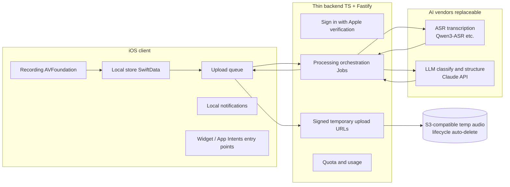

# Voice Inbox — Project Document

| | |
|---|---|
| **Version** | v0.1 |
| **Date** | 2026-08-27 |
| **Status** | Planning complete, starting M0 |
| **Platform** | iOS (first release) |
| **Working name** | Voice Inbox / 语音收件箱 (final name TBD) |
| **Source** | Full decision record from the 2026-08-27 planning session, compiled and extended with implementation drafts by Claude Code. Chinese original: [PROJECT.zh-CN.md](PROJECT.zh-CN.md) |

**Document conventions**: Sections 1–6 and 10–11 record **decisions and thinking confirmed** in the planning session; sections 7–9 and 12 are this document's **first-draft implementation proposals** — they follow the locked technical direction but details may change during development; section 13 lists risks and open questions.

---

## 1. Origin and Core Thinking

### 1.1 The original idea (recorded faithfully)

A startup idea combining hardware and software. The hardware form factor is undecided; software goes first: a phone app with **quick-access entry points**, built around four scenarios:

1. **To-do** — Every morning, talk through the day's tasks. The audio goes to a model; once it recognizes a to-do intent it automatically creates a to-do list — a title (e.g. "today's work items") plus a description (what the priorities are). The original pitch mentioned "building an MCP so it can create these entries itself," i.e. the model produces structured items directly through tool calls.
2. **Reminder** — Time-based nudges: a meeting at a certain hour, buying groceries after work, a package waiting for pickup.
3. **Idea** — When the speech is recognized as an idea (a short-video topic, a creative spark), capture it as a quick note; the model lightly organizes the whole recording into a small module stored in the app.
4. **Meeting / important topic** — Manually switch on during a conversation or interview with someone important; a longer recording that is automatically turned into meeting notes afterwards.

### 1.2 Core insights

- **Capture friction is the root problem.** Ideas, tasks, and reminders are most easily lost in the moment they occur. Opening a notes app, picking a category, typing things out — every step of friction kills the capture rate. Voice is the lowest-friction input.
- **The user should never do the classifying.** Traditional productivity tools make the user decide "is this a task or a note?" up front — that decision is itself a burden. The right division of labor: **the user just talks; AI does the organizing.** This is the GTD "inbox" concept, voiced.
- **Confirmation stays with the user.** AI classification and structuring will make mistakes, so the loop must include a user-confirmation step. AI output is a draft, never the final word.

### 1.3 Long-term vision

- **A wearable hardware entry point**: the eventual form may be a physical button / pendant-style device — press once, start recording. The MVP validates the "say one thing, anytime" need with software alone (Widget, Action Button, Lock Screen controls) before committing to hardware.
- **An MCP ecosystem**: the original "build an MCP" idea is kept as a future direction — expose the inbox's data and capture capability as an MCP server, so the user's other AI tools can read and write this inbox, making it the hub for personal tasks and ideas rather than yet another data silo.

---

## 2. Product Definition

### 2.1 One-line positioning

An **AI voice inbox** for knowledge workers: talk to the single button at the center of the screen, and what you say automatically becomes a to-do, a reminder, or an idea card; important conversations get a manual meeting mode that produces notes afterwards.

### 2.2 Target users

**Personal-productivity knowledge workers**: founders, product managers, freelancers, content creators. Their defining trait is that all three needs coexist — lots of fragmented ideas, lots of daily tasks and reminders, and the occasional important meeting or interview to record.

(The alternative positionings — "creators first" and "heavy-meeting users first" — were rejected because they narrow the product to a single-purpose tool, while the differentiation is precisely "one entry point that catches every type.")

### 2.3 Core loop

```
Record → Transcribe → Classify intent → Structure → User confirms → Save / schedule reminder
```

Short captures (To-do / Reminder / Idea) are fully auto-classified. Meeting recordings are started **manually** by the user — never auto-detected. This is a deliberate product decision to avoid privacy risk and accidental recording.

### 2.4 Design principles

1. **A single entry point**: the home screen has exactly one record button; the user makes no choices before speaking (meeting mode excepted).
2. **Zero pre-classification**: classification is AI's job and happens after recording.
3. **Draft → confirm**: AI results always expose the raw transcript and can be edited or reclassified.
4. **Local-first**: structured results live on the device; the cloud is a *processor*, not a *warehouse*.
5. **Function before polish**: all visual enhancements (card-flip animations etc.) are deferred; ship the loop first.

---

## 3. MVP Scope

### 3.1 In scope

- Quick voice capture: tap-to-record, press-and-hold, drag-to-lock continuous recording.
- Automatic recognition of three short-content types: To-do, Reminder, Idea.
- Manual Meeting mode: long recording + post-meeting summary.
- In-app task management; Reminders fire via iOS local notifications.
- Viewing, editing, and reclassifying the raw transcript and AI results.
- Sign in with Apple.
- Local-first storage; cloud handles transcription and AI structuring.
- App Shortcut, Action Button, and Widget entry points.

### 3.2 Explicitly out of scope (and why)

| Not doing | Why |
|---|---|
| Dedicated hardware / Bluetooth button | Validate demand with software first; hardware means firmware, pairing, background-behavior work |
| Syncing to Apple Reminders / Calendar / third-party task tools | Permissions, conflict handling, and data mapping are complex; the in-app loop is enough to validate value |
| Collaboration, Web, Android | Focus on the single-user iOS scenario |
| Full cross-device sync | Sync on a local-first architecture is a major project; Sign in with Apple already paves the way |
| Card-flip animations and other rich visuals | Function before polish; queued in the enhancements backlog |
| Auto-detecting and starting meeting recordings | Privacy and misfire risk — meeting recording must be user-initiated |

---

## 4. Decision Log

Key decisions confirmed one by one in the planning session. Each row keeps the alternatives and the reasoning of the moment, so "why is it this way" can be traced later.

| # | Decision | Alternatives | Choice | Reasoning |
|---|---|---|---|---|
| 1 | Positioning | A Voice inbox (recommended); B AI toolbox (pick a mode before recording); C Meeting-notes first | **A** | The differentiation is "the user just talks"; pre-selecting a mode violates the zero-friction principle; meetings-first narrows the product |
| 2 | Voice data | A Hybrid (recommended); B Cloud-first; C On-device-first | **A** | Structured results stay local; short-capture audio is deleted after processing; the user decides whether meeting audio is kept; the cloud does transcription and structuring. C is limited by on-device model capability and device compatibility; B carries heavier cost and privacy burdens |
| 3 | Tasks & reminders | A In-app + local notifications (recommended); B Sync to system Reminders / Calendar; C Both | **A** | Simplest permissions and sync logic, most stable MVP; B / C significantly expand scope |
| 4 | Hardware | A Software-only first (recommended); B Bluetooth-button prototype in parallel; C Hardware-first | **A** | Widget / Action Button / Lock Screen controls stand in for a hardware shortcut; validate demand first |
| 5 | First users | A Personal-productivity knowledge workers (recommended); B Content creators; C Heavy-meeting users | **A** | Only users with all three needs can validate the core hypothesis: "one entry point catches every type" |
| 6 | Accounts | A No sign-up (recommended); B Sign in with Apple; C Guest + optional login sync | **B** | The one deviation from a recommendation. Accept a little login and compliance work in exchange for real user identity, paving the way for cross-device and productization |
| 7 | Implementation route | ① Native iOS + thin self-built backend (recommended); ② Native iOS + Supabase / Firebase; ③ Local-first + client calls AI directly | **①** | Native gives the best shortcut entry points and recording experience; API keys never ship in the client; data, models, and vendors all stay replaceable. ② scatters business logic and raises migration cost; ③ can't hold keys safely and makes quota/auditing hard |
| 8 | UI style | A Calm Capture, warm and quiet (recommended); B Native Minimal; C Dark Focus | **B** | Explicit user requirement: "premium, clean, efficient-feeling" (要高级、简洁，给人很有效率的感觉). Iterations in section 6 |

---

## 5. Functional Spec

### 5.1 Quick capture (short voice)

- Entry: the central record button on the home screen; App Shortcut / Action Button / Widget / Lock Screen control jump straight into recording.
- While recording: a timer and simple level feedback; cancel is available.
- On stop, processing starts automatically (upload → transcribe → classify → structure); a placeholder card appears at the top of the inbox while processing.
- When done, the capture enters a **confirmation state**: the AI classification and structured content are shown; the user can confirm with one tap, edit, or change the type.

### 5.2 To-do

- One recording produces one To-do card: title + description + a checkable subtask list (the morning's several items become subtasks).
- Subtasks can be checked off directly on the card; when all are done the card is marked complete.
- Presentation: a vertical rectangular content card (not row after row of small items).

### 5.3 Reminder

- AI extracts the event and time from speech ("meeting at 3pm" → today 15:00) and generates a reminder card.
- On confirmation, an iOS local notification is registered; editing or deleting the card updates/cancels the notification.
- If no definite time can be parsed, the card degrades to a pending state for the user to fill in the time.

### 5.4 Idea

- AI organizes the spoken idea into a small module: title + bullet points.
- Presentation: offset stacked cards (conveying "more behind"). The MVP ships a **static stack** that expands on tap; swipe/flip animation goes to the backlog.

### 5.5 Meeting mode

- Manually started, with a prominent recording indicator; keeps recording with the screen locked (background audio mode).
- Afterwards: upload, transcribe, and generate meeting notes — summary, sectioned key points, action items (one tap converts an action item into a To-do).
- Whether the original audio is kept is the user's call (asked by default at the end).

### 5.6 Confirmation and correction

- Every card exposes the **full raw transcript**.
- Misclassifications can be fixed manually (To-do ↔ Reminder ↔ Idea); structured fields migrate where possible.
- On low intent confidence the system does not force a class — the capture lands as an "unclassified" card for the user to handle. Better to under-automate than to mis-automate.

---

## 6. UI Baseline

### 6.1 Style evolution (exploration preserved)

| Version | Content | User feedback |
|---|---|---|
| v1 | Three directions: A Calm Capture / B Native Minimal / C Dark Focus | Chose **B**: "premium, clean, efficient-feeling". Inbox must use vertical rectangular content cards, not small row items; To-do is a card, Idea is a flippable card stack; "the most basic version doesn't need to be that beautiful — implement the function first" |
| v2 | Black-and-white neutral + vertical content cards + multi-check To-do + offset Idea stack | Direction approved; asked to reference iOS Reminders |
| v3 | Modeled on iOS Reminders: large title, Smart Lists summary tiles, native task rows, completion circles, bottom voice entry. Style reference, not a pixel copy | Move the record button to the **center of the screen** as the single input; proposed press-and-hold / drag-to-lock interactions |
| v4 | Central record button + four-state interaction spec | Interactions approved; "no green — something brighter, yellow- or orange-ish" |
| v5 | Accent changed to warm amber | ✓ Locked as the UI baseline |

### 6.2 Home screen information architecture (top to bottom)

1. Large title (iOS Large Title style).
2. Smart Lists summary tiles: counts for Today / To-dos / Reminders / Ideas.
3. Inbox stream: vertical rectangular content cards, reverse-chronological; processing cards pinned on top as placeholders.
4. **Center of the screen: the record button** — the app's only input.
5. Meeting mode via a secondary entry on the record button (long-press menu or an adjacent affordance; decided at implementation time).

### 6.3 Central record button interaction spec

Four states: **Idle → Hold-to-record → Drag-to-lock → Stop / Cancel**.

| Gesture | Behavior |
|---|---|
| Tap | Start recording; tap again to stop and submit |
| Press and hold | Record while held; release to stop and submit |
| Hold, then drag to the lock icon | Enter hands-free continuous recording (locked state) |
| Locked: tap the central button | Stop and submit |
| Locked: tap × | Discard the recording |
| Drag back to center mid-drag | Abandon the lock, back to hold state |

**Accessibility**: the tap path always retains full functionality, so VoiceOver users and users with motor impairments never depend on hold or drag.

### 6.4 Card specs

- **To-do card**: vertical content card, title + description + checkable subtask rows (completion circles referencing Reminders).
- **Reminder card**: title + fire-time badge; overdue cards get a visual cue.
- **Idea card**: offset stack (edges of cards behind peeking out); static in the MVP; tap to expand.
- **Meeting card**: title + duration + summary preview; details show sectioned notes and action items.

### 6.5 Color and typography (suggested values, tune at implementation)

- Base: black-and-white neutral, restrained, generous whitespace. Light mode: white ground, near-black text; dark mode inverts.
- Accent (the only color) — a two-mode identity (locked 2026-08-30): **day = white ground + orange `#FF8C1A`; night = black ground + yellow `#FFD60A`**. Glyphs on the accent flip with it (white on orange, black on yellow). Used only for the record button, in-progress states, and key actions. **No green** (explicit user requirement). The app icon ships both appearances.
- Type: system SF Pro; Large Title (34pt bold), body 17pt — native iOS rhythm.

### 6.6 Enhancements backlog (post-MVP)

Idea card flip/swipe animation with inertia, haptic feedback (Core Haptics), recording waveform motion, card transitions.

---

## 7. Technical Architecture

> From here on: implementation drafts. They follow the locked route (native iOS + thin self-built backend); details may change.

### 7.1 Overview



Responsibility boundary: the **client** owns recording, local data, notifications, shortcut entry points, and all UI. The **backend** does exactly five things — verify identity, sign temporary upload URLs, orchestrate transcription and structuring, enforce quotas, and briefly hold audio in flight. The backend **never** stores content long-term.

### 7.2 iOS client

| Area | Technology |
|---|---|
| UI | SwiftUI |
| Local data | SwiftData |
| Recording | AVFoundation (`AVAudioSession` + `AVAudioRecorder` / `AVAudioEngine`); Meeting mode enables background audio (`UIBackgroundModes: audio`) and handles call interruptions and route changes |
| Notifications | UserNotifications (local) |
| Entry points | App Intents (App Shortcut, Action Button), WidgetKit, Lock Screen controls |
| Sign-in | AuthenticationServices (Sign in with Apple) |
| Audio format | AAC (`.m4a`); short captures upload as a single file; meeting audio uploads whole at the end in the MVP, chunked upload is a later optimization |

### 7.3 Backend (thin)

- **Runtime**: TypeScript + **Fastify** (the thinner of the two options from the planning session; migrate to NestJS later if modules grow).
- **Database**: PostgreSQL — users, quotas, job state only. No content.
- **Object storage**: S3-compatible (AWS S3 / Cloudflare R2) with a lifecycle rule: audio objects auto-delete at a 24-hour TTL as a backstop, and are deleted immediately on successful processing.
- **Deployment**: a single container to start (Fly.io / Railway / any cloud); no microservices in the MVP.

### 7.4 AI layer

Two replaceable interfaces, called only from the backend (API keys never leave it):

```ts
interface ASRProvider {
  transcribe(audio: AudioRef, opts: { mode: "quick" | "meeting"; localeHint?: string }):
    Promise<{ text: string; segments?: Segment[]; language: string }>
}
interface Structurer {
  structure(transcript: string, ctx: { now: string; timezone: string }):
    Promise<{ intent: "todo" | "reminder" | "idea" | "unclassified"; confidence: number; payload: TodoPayload | ReminderPayload | IdeaPayload }>
  summarizeMeeting(transcript: string): Promise<MeetingNotes>
}
```

- **ASR**: the MVP starts with a hosted API to validate the loop (e.g. Qwen3-ASR hosted on Alibaba Cloud Model Studio); self-hosting on vLLM is decided after the bake-off. Candidates and evaluation plan in section 10.
- **LLM (classification + structuring + meeting summaries)**: Anthropic Claude API (`@anthropic-ai/sdk`). Default model `claude-opus-5` ($5 / $25 per million tokens, input / output), with structured outputs (`output_config.format` / `messages.parse()`) guaranteeing schema-conformant JSON — no parsing fallbacks. If cost matters at scale, evaluate `claude-haiku-4-5` ($1 / $5) — but that's a product decision; use the best model first and get the experience right.
- **Time parsing**: relative times in Reminders ("3pm", "tomorrow morning") are resolved to absolute times by the LLM using the request's `now` + `timezone`; the confirmation screen shows the parsed result for correction.

### 7.5 Short-capture processing sequence

```
Client                      Backend                     AI
  │ recording ends
  │ POST /captures ────────▶ create job, sign upload URL
  │ ◀──────────────────────  {captureId, uploadUrl}
  │ PUT audio ─────────────▶ (S3)
  │ POST /captures/:id/process ▶ orchestration starts
  │                          ├─▶ ASR transcribe
  │                          ├─▶ LLM classify + structure
  │                          └─ delete S3 audio
  │ GET /captures/:id poll ◀─ {transcript, intent, payload}
  │ confirmation screen → user confirms
  │ save to SwiftData; Reminder registers local notification
```

The MVP polls (2–3 s interval; end-to-end target for short captures < 10 s); SSE can replace polling later. Any failed stage sets the job to `failed` with a readable reason; the client keeps the local audio for retry.

### 7.6 Auth and usage

- The Sign in with Apple identity token is verified against Apple by the backend, which issues its own short-lived JWT access token.
- A per-user quota table tracks daily short-capture count and monthly meeting-transcription minutes. Exceeding quota returns a clear error the client displays. This is the first cost gate.

---

## 8. Data Model (draft)

### Client (SwiftData — the only long-term content store)

| Entity | Key fields |
|---|---|
| `CaptureRecord` | id, createdAt, mode (quick / meeting), status (recording → uploading → processing → awaitingConfirm → saved / failed), audioLocalURL?, transcript, language |
| `TodoCard` | title, details, subtasks [{text, done}], completedAt?, source captureId |
| `ReminderCard` | title, fireDate, notificationId, done, source captureId |
| `IdeaCard` | title, bullets[], source captureId |
| `MeetingNote` | title, duration, summary, sections[], actionItems[] (convertible to TodoCard), audioKept: Bool, source captureId |

### Server (PostgreSQL — no content storage)

| Table | Key fields |
|---|---|
| `users` | id, apple_sub, created_at |
| `jobs` | id, user_id, mode, status, error?, created_at, finished_at (transcripts and results are held only within the processing window and cleared after delivery) |
| `usage` | user_id, date, quick_count, meeting_seconds |

---

## 9. API Draft

| Method & path | Purpose |
|---|---|
| `POST /v1/auth/apple` | Exchange identity token for JWT |
| `POST /v1/captures` | Create a capture; returns `{captureId, uploadUrl}` |
| `POST /v1/captures/:id/process` | Start processing (body: mode, localeHint, timezone) |
| `GET /v1/captures/:id` | Poll status and result `{status, transcript?, intent?, payload?}` |
| `DELETE /v1/captures/:id` | Cancel / clean up |
| `GET /v1/me/usage` | Quota and usage |

Conventions: Bearer JWT; errors return `{code, message}`; the server clears content fields once results are delivered.

---

## 10. ASR Selection (research record)

### On WeChat's voice input

WeChat uses Tencent's commercial speech engine ("WeChat Zhiling" / 微信智聆): Chinese + English, streaming endpointing, denoising, punctuation prediction, hotwords, with a claimed peak Mandarin accuracy of 97%. **Not open source** — the production model's weights, training data, and inference code are unavailable; Tencent's public SDK is only a cloud-service client. Conclusion: the WeChat model cannot be deployed; selection happens among open-source models.

### Open-source candidates (surveyed 2026-08)

| Model | Position | Notes |
|---|---|---|
| **Qwen3-ASR-1.7B** | **Primary** | Apache 2.0; offline and streaming, long audio; 30 languages + 22 Chinese dialects; positioned as open-source SOTA; vLLM deployable |
| **Fun-ASR-Nano-2512** | Cost / latency backup | 800M params; strong Chinese, English, Japanese and many dialects; hotword support; limited timestamp reliability |
| **SenseVoiceSmall** | Short-capture candidate | Very fast; Mandarin / Cantonese / English; meetings need extra VAD, punctuation, and diarization modules |
| **Whisper large-v3 / turbo** | Control baseline | Most mature ecosystem, widest language coverage; Chinese-specialized models usually win on Chinese |

### Bake-off plan (required before final selection)

> Key realization: **"supports Chinese and English" does not mean code-switching within one sentence works well.** Never trust vendor leaderboards alone.

- **Sample set**: real recordings — Mandarin, English, Mandarin-English code-switching, proper nouns (names / products / jargon), noisy environments, far-field meetings; several clips each.
- **Metrics**: character error rate (CER), proper-noun accuracy, latency, GPU / API cost.
- **Decision rule**: the bake-off result picks the MVP workhorse. Primary candidate Qwen3-ASR-1.7B, cost backup Fun-ASR-Nano, international baseline Whisper large-v3-turbo.
- **Meetings**: VAD, speaker diarization, and timestamp modules are layered on later regardless of the base model.

---

## 11. Privacy and Security

- **Data minimization**: cloud audio is deleted on completion (24h TTL backstop); transcripts and structured results are cleared server-side after delivery; the only long-term content store is the user's device.
- **Meeting audio**: kept only if the user chooses; asked by default at the end.
- **Recording ethics**: manual start + a prominent recording indicator. Notification obligations vary by jurisdiction; the app provides prompt copy, compliance responsibility rests with the user, stated in the terms.
- **Key security**: all model API keys live in backend environment variables; the client ships zero secrets.
- **Permission copy**: microphone and notification prompts state their concrete purpose (an App Store review focus).
- **Privacy labels**: honestly declared — "audio data — used for app functionality — not used for tracking."

---

## 12. Milestones

| Phase | Content | Definition of done |
|---|---|---|
| **M0 Scaffolding** | Xcode project + SwiftUI skeleton; Fastify backend skeleton + Postgres / S3 wired | Health checks pass on both ends |
| **M1 Recording core** | Four-state central button, timer and level meter, audio persisted locally | A full recording completed and played back on a real device |
| **M2 Cloud pipeline** | Upload → hosted ASR → Claude classify/structure → confirmation screen | Saying "meeting tomorrow at 3pm" becomes a pending Reminder card end-to-end |
| **M3 Inbox** | Three card types, To-do checking, Reminder local notifications, static Idea stack, Smart Lists tiles | Notifications fire on time; all three card types CRUD |
| **M4 Meeting** | Background long recording, upload on finish, meeting-notes screen, action items → To-do | A 30-minute real recording produces usable notes |
| **M5 Release prep** | Sign in with Apple, quotas, Widget / Action Button / App Shortcut, ASR bake-off finalized, TestFlight | Installable via TestFlight |

In parallel: collect real recording samples from M2 on; finish the ASR bake-off before M5.

---

## 13. Risks and Open Questions

| # | Risk / question | Mitigation |
|---|---|---|
| 1 | Mandarin-English code-switching accuracy unverified | Section 10 bake-off; this is the decisive selection test |
| 2 | Intent misclassification erodes trust | Confirmation step + low-confidence "unclassified" fallback + one-tap type change |
| 3 | iOS background-recording limits (interruptions, termination) | Background audio mode + interruption recovery + chunked persistence against data loss |
| 4 | Upload failures on weak networks | Keep local audio + retrying upload queue |
| 5 | Transcription + LLM cost of long meetings | Quotas (§7.6) + meeting length cap (MVP suggestion ≤ 2 h) |
| 6 | App Store review (recording purpose, privacy) | §11 permission copy and privacy labels; pre-submission checklist |
| 7 | Product name undecided | Working name Voice Inbox; name and icon before release |
| 8 | Can Apple's speech frameworks serve as offline fallback? | Open question: evaluate SFSpeechRecognizer and the iOS 26-generation Speech APIs as a no-network / low-cost fallback transcription path |
| 9 | When to start the MCP hub vision | Evaluate post-MVP; keep the data model export-friendly (§1.3) |

---

*Compiled from the full 2026-08-27 planning-session record; implementation drafts added by Claude Code. Next step: M0 scaffolding.*
