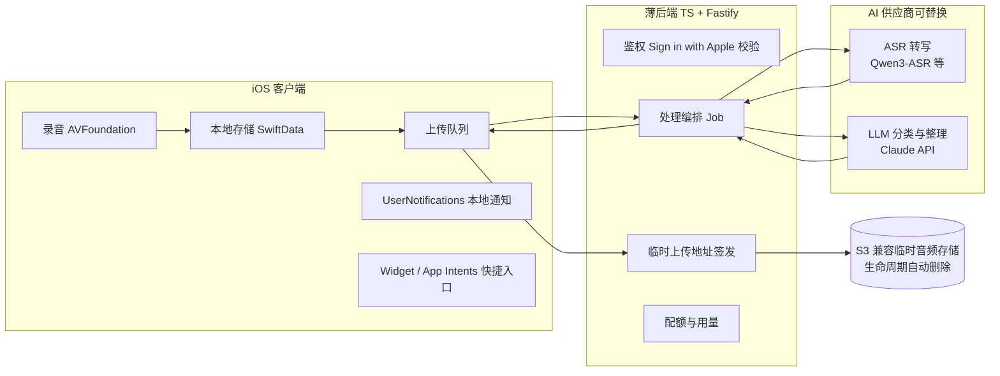

# 语音收件箱（Voice Inbox）项目文档

| | |
|---|---|
| **版本** | v0.1 |
| **日期** | 2026-08-27 |
| **状态** | 规划完成，待启动 M0 |
| **平台** | iOS（首发） |
| **工作名** | Voice Inbox / 语音收件箱（正式命名未定） |
| **来源** | 2026-08-27 ChatGPT 规划会的完整决策记录，由 Claude Code 整理成文并补全实现细节 |

**文档约定**：第 1–6 节、第 10 节记录的是规划会上**已确认的决策与思想**；第 7–9 节的架构、数据模型、API 是本文档给出的**首版实现草案**，符合已锁定的技术路线，细节可在开发中调整；第 12–13 节是路线图与开放问题。

---

## 1. 项目起源与核心思想

### 1.1 原始想法（忠实记录）

这是一个硬件与软件结合的创业 idea。硬件形态暂未确定，软件形态先行：手机上一个**有快捷入口**的 App，围绕四个场景：

1. **To-do**：每天早晨对着它讲一遍今天要做的事。语音交给模型，模型识别出这是待办意图后，自动创建一个 to-do list——包含 title（比如"今天工作上的事情"）和 description（重点是什么）。原始设想中提到"建一个 MCP，让它可以自己创建这个东西"，即模型通过工具调用直接产生结构化条目。
2. **Reminder**：提醒几点要干嘛——几点有会、下班买菜、快递没拿。
3. **Idea**：识别到讲的是一个想法（短视频选题、创作灵感），就当作快速笔记记下来，整段语音交给模型稍作整理，形成一个小模块存进 App。
4. **Meeting / 重要话题**：和重要的人聊天或访谈时手动打开，进行较长时间录音，结束后自动整理成会议笔记。

### 1.2 核心洞察

- **捕捉的摩擦力是根本问题**。想法、任务、提醒在产生的那一瞬间最容易丢失；打开笔记软件、选分类、打字整理，每一步摩擦都在杀死捕捉率。语音是摩擦最低的输入方式。
- **用户不应该做分类**。传统效率工具要求用户先想清楚"这是待办还是笔记"，这本身就是负担。正确的分工是：**用户只管说，AI 负责整理**——这是 GTD"收件箱"理念的语音化。
- **确认权留给用户**。AI 分类和整理会出错，所以闭环里必须有"用户确认"一环，AI 的输出是草稿而非最终结果。

### 1.3 长期愿景

- **随身硬件入口**：最终形态可能是一个实体按键/挂件类设备，一按即录。MVP 先用纯软件（Widget、Action Button、锁屏控件）验证"随时说一句"这个需求是否成立，再决定是否投入硬件。
- **MCP 生态**：原始想法中"建一个 MCP"的思路保留为未来方向——把收件箱的数据和捕捉能力暴露为 MCP server，让用户的其他 AI 工具（Claude、其他 agent）可以读写这个收件箱，使它成为个人任务/想法的中枢而不是又一个数据孤岛。

---

## 2. 产品定义

### 2.1 一句话定位

面向知识工作者的 **AI 语音收件箱**：对着屏幕中央唯一的按钮说话，系统自动把你说的话变成待办、提醒或想法卡片；重要谈话手动开启会议模式，会后自动生成笔记。

### 2.2 目标用户

**个人效率型知识工作者**：创业者、产品经理、自由职业者、内容创作者。特征是三类需求并存——碎片化想法多、日常任务和提醒多、偶尔有重要会议/访谈需要记录。

（备选的"内容创作者优先"和"高频会议人群优先"两个定位被放弃，因为它们会把产品窄化为单一功能工具，而本产品的差异化恰恰在"一个入口接住所有类型"。）

### 2.3 核心闭环

```
录音 → 转写 → 意图分类 → 结构化整理 → 用户确认 → 保存 / 触发提醒
```

短语音（To-do / Reminder / Idea）走全自动分类；Meeting 长录音由用户**手动**开启，不做自动识别启动——这是刻意的产品决定，避免隐私风险和误录。

### 2.4 设计原则

1. **唯一入口**：主界面只有一个录音按钮，不让用户在录音前做任何选择（Meeting 模式除外）。
2. **零预分类**：分类是 AI 的工作，发生在录音之后。
3. **草稿—确认**：AI 结果始终可查看原始转写、可修改、可重新分类。
4. **本地优先**：结构化结果存在设备上，云端只做"加工"，不做"仓库"。
5. **功能先于美观**：MVP 阶段视觉增强（翻卡动画等）全部后置，先把闭环跑通。

---

## 3. MVP 范围

### 3.1 包含

- 短语音快速捕捉：轻点录音、长按录音、拖动锁定持续录音。
- 自动识别三种短内容：To-do、Reminder、Idea。
- 手动 Meeting 模式：长录音 + 会后自动总结。
- App 内待办管理，Reminder 通过 iOS 本地通知触发。
- 原始转写与 AI 整理结果的查看、修改、重新分类。
- Sign in with Apple。
- 本地优先存储；云端负责转写和 AI 整理。
- App Shortcut、Action Button、Widget 快捷入口。

### 3.2 明确不做（及原因）

| 不做 | 原因 |
|---|---|
| 独立硬件 / 蓝牙按键 | 先用软件验证需求；硬件涉及固件、配对、后台行为，成本高 |
| 同步 Apple 提醒事项 / 日历 / 第三方任务工具 | 权限、冲突处理、数据映射复杂度高，MVP 用 App 内闭环即可验证价值 |
| 多人协作、Web 端、Android | 聚焦单人 iOS 场景 |
| 完整跨设备同步 | 本地优先架构下同步是大工程；Sign in with Apple 已为将来铺路 |
| Idea 翻卡动画等复杂视觉 | 功能先于美观，列入增强项 backlog |
| 自动识别并启动会议录音 | 隐私与误录风险，会议录音必须用户主动开启 |

---

## 4. 决策记录

规划会上逐项确认的关键决策。每项列出备选方案，保留当时的思考。

| # | 决策点 | 备选方案 | 最终选择 | 理由 / 思想 |
|---|---|---|---|---|
| 1 | 产品定位 | A 语音收件箱（推荐）；B AI 工具箱（四功能并列，录前选模式）；C 会议记录优先 | **A** | 差异化在"用户只管说"；预选模式违背零摩擦原则；会议优先会窄化产品 |
| 2 | 语音数据方案 | A 混合（推荐）；B 云端优先；C 本地优先 | **A** | 本地存结构化结果、短语音处理完即删、会议原始录音由用户决定是否保留、云端做转写与整理。兼顾开发速度、效果与隐私。C 受限于端侧模型能力与机型兼容；B 成本与隐私负担重 |
| 3 | 任务与提醒落地 | A App 内 + 本地通知（推荐）；B 同步系统提醒/日历；C 两者都做 | **A** | 权限与同步逻辑最简单，MVP 最稳定；B/C 明显扩大范围 |
| 4 | 硬件策略 | A 首版纯软件（推荐）；B 同步做蓝牙按键原型；C 硬件优先 | **A** | 用 Widget / Action Button / 锁屏控件替代硬件快捷键，先验证需求 |
| 5 | 首批用户 | A 个人效率型知识工作者（推荐）；B 内容创作者；C 高频会议人群 | **A** | 三类需求并存的人群才能验证"一个入口接住所有类型"的核心假设 |
| 6 | 账户策略 | A 无需注册（推荐）；B Sign in with Apple；C 游客可用+登录同步 | **B** | 唯一一处偏离推荐项的选择。接受少量登录与合规工作，换取正式的用户身份，为后续跨设备与产品化铺路 |
| 7 | 实现路线 | ① 原生 iOS + 轻量自建后端（推荐）；② 原生 iOS + Supabase/Firebase；③ 本地优先 + 客户端直调 AI | **①** | 原生的快捷入口和录音体验最好；API Key 不暴露在客户端；数据、模型、供应商均可替换。②业务逻辑易分散、迁移成本高；③无法安全保存密钥、难做配额审计 |
| 8 | UI 风格 | A Calm Capture 温暖安静（推荐）；B Native Minimal 极简系统感；C Dark Focus 深色科技感 | **B** | 用户明确要求："高级、简洁，给人很有效率的感觉"。后续迭代详见第 6 节 |

---

## 5. 功能规格

### 5.1 快速捕捉（短语音）

- 入口：主屏中央录音按钮；App Shortcut / Action Button / Widget / 锁屏控件直达录音态。
- 录音中显示计时与简单电平反馈；支持取消。
- 录音结束自动进入处理流程（上传 → 转写 → 分类 → 整理），处理中卡片以占位态出现在收件箱顶部。
- 处理完成后进入**确认态**：展示 AI 分类结果与结构化内容，用户可一键确认、编辑或改分类。

### 5.2 To-do

- 一条语音可产出一张 To-do 卡：title + description + 可勾选的子任务列表（早晨口述的多件事拆成多个子项）。
- 卡片上可直接勾选完成，全部完成后卡片标记为已完成。
- 展示形态：纵向长方形内容卡（不是一行一行的小条目）。

### 5.3 Reminder

- AI 从语音中抽取事件与时间（"下午三点开会"→ 今天 15:00），生成提醒卡。
- 确认后注册 iOS 本地通知（`UserNotifications`）；修改或删除卡片时同步更新/取消通知。
- 无法解析出明确时间时，降级为待确认状态，让用户手动补时间。

### 5.4 Idea

- AI 把口述的想法整理成小模块：标题 + 要点。
- 展示形态：错位堆叠卡片（表达"后面还有更多"），MVP 做**静态堆叠**，点击展开列表；翻卡滑动动画列入增强项。

### 5.5 Meeting 模式

- 手动开启，明显的录音中状态指示；支持锁屏后继续录音（后台音频模式）。
- 结束后上传转写，生成会议笔记：摘要、要点分节、行动项（行动项可一键转为 To-do）。
- 原始录音是否保留由用户决定（默认询问）。

### 5.6 确认与修正

- 每张卡片都可查看**原始转写全文**。
- 分类错误可手动改类型（To-do ↔ Reminder ↔ Idea），改类型后结构化字段尽量保留迁移。
- 意图置信度低时不强行分类，落为"未分类"通用卡片，等用户处理——宁可少自动化，不可错自动化。

---

## 6. UI 设计基线

### 6.1 风格演进记录（保留探索过程）

| 版本 | 内容 | 用户反馈 |
|---|---|---|
| v1 | 三方案：A Calm Capture / B Native Minimal / C Dark Focus | 选 **B**："要高级、简洁，给人很有效率的感觉"；Inbox 不要一行一行的小卡片，要**纵向长方形内容卡**；To-do 是一行式卡片、Idea 是可翻动的堆叠卡片；"最基础的版本不用那么美观，先把功能实现出来" |
| v2 | 黑白中性 + 纵向内容卡 + To-do 多任务勾选 + Idea 错位堆叠 | 方向认可，要求参考 iOS 提醒事项 |
| v3 | 模仿 iOS Reminders：大标题、Smart Lists 摘要方块、原生任务行、完成圆点、底部语音入口。风格借鉴，不逐像素复制 | 录音按钮要放到**屏幕正中央**，作为唯一输入口，并提出长按/拖动锁定交互 |
| v4 | 中央录音按钮 + 四态交互稿（待机/长按录音/拖动锁定/停止取消） | 交互认可；"别用绿色，改成亮一点的类似于黄色或者橙色" |
| v5 | 强调色改为暖橙黄（amber） | ✅ 定稿为 UI 基线 |

### 6.2 首页信息架构（自上而下）

1. 大标题（iOS Large Title 风格）。
2. Smart Lists 摘要方块：今天 / 待办 / 提醒 / 想法的计数入口。
3. 收件箱流：纵向长方形内容卡，按时间倒序；处理中的卡片以占位态置顶。
4. **屏幕正中央：录音按钮**——整个 App 唯一的输入口。
5. Meeting 模式从录音按钮的次级入口进入（长按菜单或按钮旁小入口，实现时定）。

### 6.3 中央录音按钮交互规格

| 手势 | 行为 |
|---|---|
| 轻点 | 开始录音；再次轻点停止并提交 |
| 长按 | 按住持续录音；松手结束并提交 |
| 长按后拖向锁图标 | 进入免按住的持续录音（锁定态） |
| 锁定态点击中央按钮 | 停止并提交 |
| 锁定态点击 × | 删除本次录音 |
| 拖动过程中移回中央 | 放弃锁定，回到长按态 |

四态：**待机 → 长按录音 → 拖动锁定 → 停止/取消**。

无障碍要求：轻点路径始终保留完整功能，确保 VoiceOver 用户和运动障碍用户不依赖长按/拖动也能完成全部操作。

### 6.4 卡片规格

- **To-do 卡**：纵向内容卡，title + description + 子任务勾选行（完成圆点样式参考 Reminders）。
- **Reminder 卡**：title + 触发时间徽标；过期未处理有视觉提示。
- **Idea 卡**：错位堆叠（露出后层边缘），MVP 静态；点击展开。
- **Meeting 卡**：title + 时长 + 摘要预览，进入详情看分节笔记与行动项。

### 6.5 色彩与排版（建议值，实现时微调）

- 基调：黑白中性、克制，大量留白。浅色模式白底近黑文字，深色模式反转。
- 强调色（唯一彩色）：暖橙黄 amber——浅色模式约 `#FFA01E`，深色模式提亮至约 `#FFB84D`；仅用于录音按钮、进行中状态、关键操作。**不使用绿色**（用户明确要求）。
- 字体：系统 SF Pro；大标题用 Large Title（34pt bold），正文 17pt，与 iOS 原生节奏一致。

### 6.6 增强项 backlog（MVP 后）

Idea 翻卡滑动动画与惯性、触感反馈（Core Haptics）、录音波形动效、卡片转场动画。

---

## 7. 技术架构

> 本节起为实现草案：符合已锁定路线（原生 iOS + 轻量自建后端），细节可调。

### 7.1 总览



职责边界：**客户端**负责录音、本地数据、通知、快捷入口和全部 UI；**后端**只做五件事——验证身份、签发临时上传地址、编排转写与整理、控制配额、短暂保管处理中的音频。后端**不**长期存储任何内容数据。

### 7.2 iOS 客户端

| 领域 | 技术 |
|---|---|
| UI | SwiftUI |
| 本地数据 | SwiftData |
| 录音 | AVFoundation（`AVAudioSession` + `AVAudioRecorder`/`AVAudioEngine`），Meeting 模式启用后台音频（`UIBackgroundModes: audio`），处理电话打断与路由切换 |
| 通知 | UserNotifications（本地通知） |
| 快捷入口 | App Intents（App Shortcut、Action Button）、WidgetKit、锁屏控件 |
| 登录 | AuthenticationServices（Sign in with Apple） |
| 音频格式 | 建议 AAC（`.m4a`），短语音单文件上传；会议录音 MVP 结束后整体上传，弱网分段上传列为优化项 |

### 7.3 后端（薄）

- **运行时**：TypeScript + **Fastify**（在规划会给出的 Fastify/NestJS 中取更薄的一个；若日后模块膨胀可迁 NestJS）。
- **数据库**：PostgreSQL——只存用户、配额、任务（job）状态，不存内容。
- **对象存储**：S3 兼容（AWS S3 / Cloudflare R2），配生命周期规则：音频对象 24 小时 TTL 兜底自动删除，处理成功后立即主动删除。
- **部署**：单容器起步即可（Fly.io / Railway / 任一云），MVP 阶段不做微服务。

### 7.4 AI 层

两个可替换接口，全部只在后端调用（API Key 不出后端）：

```ts
interface ASRProvider {
  transcribe(audio: AudioRef, opts: { mode: "quick" | "meeting"; localeHint?: string }):
    Promise<{ text: string; segments?: Segment[]; language: string }>
}
interface Structurer {
  structure(transcript: string, ctx: { now: string; timezone: string }):
    Promise<{ intent: "todo" | "reminder" | "idea" | "unclassified"; confidence: number; payload: TodoPayload | ReminderPayload | IdeaPayload }>
  summarizeMeeting(transcript: string): Promise<MeetingNotes>
}
```

- **ASR**：MVP 先接托管 API 验证闭环（如阿里云百炼托管的 Qwen3-ASR 服务），横评后再决定是否自托管 vLLM。候选与横评计划见第 10 节。
- **LLM（分类 + 结构化 + 会议总结）**：Anthropic Claude API（`@anthropic-ai/sdk`）。默认模型 `claude-opus-5`（$5 / $25 每百万 token，输入/输出），用 **structured outputs**（`output_config.format` / `messages.parse()`）保证返回严格符合 schema 的 JSON，省去解析兜底。若上量后想压成本，可评估降级到 `claude-haiku-4-5`（$1 / $5）——但这是产品决策，先用最好的模型把体验做对。
- **时间解析**：Reminder 的相对时间（"下午三点""明早"）由 LLM 结合请求携带的 `now` + `timezone` 解析为绝对时间，客户端确认页展示解析结果供用户修正。

### 7.5 短语音处理时序

```
客户端                     后端                        AI
  │ 录音结束
  │ POST /captures ────────▶ 建 job，签发上传 URL
  │ ◀──────────────────────  {captureId, uploadUrl}
  │ PUT 音频 ──────────────▶ (S3)
  │ POST /captures/:id/process ▶ 编排开始
  │                          ├─▶ ASR 转写
  │                          ├─▶ LLM 分类 + 结构化
  │                          └─ 删除 S3 音频
  │ GET /captures/:id 轮询 ◀─ {transcript, intent, payload}
  │ 展示确认页 → 用户确认
  │ 存 SwiftData；Reminder 注册本地通知
```

MVP 用轮询（2–3 秒间隔，短语音端到端目标 < 10 秒）；后续可换 SSE。失败的任一环节都把 job 置为 `failed` 并返回可读原因，客户端保留本地音频以便重试。

### 7.6 鉴权与用量

- Sign in with Apple 的 identity token 由后端向 Apple 校验，换发自签 JWT（短期 access token）。
- 配额表按用户记录：当日短语音次数、当月会议转写分钟数。超限返回明确错误，客户端展示。这是成本的第一道闸门。

---

## 8. 数据模型（草案）

### 客户端（SwiftData，内容的唯一长期存储）

| 实体 | 关键字段 |
|---|---|
| `CaptureRecord` | id、createdAt、mode（quick/meeting）、status（recording→uploading→processing→awaitingConfirm→saved/failed）、audioLocalURL?、transcript、language |
| `TodoCard` | title、details、subtasks[{text, done}]、completedAt?、来源 captureId |
| `ReminderCard` | title、fireDate、notificationId、done、来源 captureId |
| `IdeaCard` | title、bullets[]、来源 captureId |
| `MeetingNote` | title、duration、summary、sections[]、actionItems[]（可转 TodoCard）、audioKept: Bool、来源 captureId |

### 服务端（PostgreSQL，无内容存储）

| 表 | 关键字段 |
|---|---|
| `users` | id、apple_sub、created_at |
| `jobs` | id、user_id、mode、status、error?、created_at、finished_at（转写与结果只在处理窗口内暂存，交付后清除） |
| `usage` | user_id、日期、quick_count、meeting_seconds |

---

## 9. API 草案

| 方法与路径 | 用途 |
|---|---|
| `POST /v1/auth/apple` | 身份令牌换 JWT |
| `POST /v1/captures` | 创建 capture，返回 `{captureId, uploadUrl}` |
| `POST /v1/captures/:id/process` | 触发处理（body: mode、localeHint、timezone） |
| `GET /v1/captures/:id` | 轮询状态与结果 `{status, transcript?, intent?, payload?}` |
| `DELETE /v1/captures/:id` | 取消/清理 |
| `GET /v1/me/usage` | 配额与用量 |

约定：Bearer JWT；错误返回 `{code, message}`；所有结果交付后服务端即清除内容字段。

---

## 10. ASR 选型（研究记录）

### 关于微信语音输入

微信使用腾讯的商业语音识别引擎「微信智聆」：支持中英文、流式端点检测、降噪、标点预测、热词，宣称普通话准确率最高 97%。**未开源**——线上模型的权重、训练数据、推理代码均不可得，腾讯公开的 SDK 只是调用云服务的客户端。结论：不能拿微信同款模型来部署，只能在开源模型中选型。

### 开源候选（2026-08 调研）

| 模型 | 定位 | 说明 |
|---|---|---|
| **Qwen3-ASR-1.7B** | **首选** | Apache 2.0；离线与流式识别、长音频；30 种语言 + 22 种中文方言；官方定位开源 SOTA；支持 vLLM 部署 |
| **Fun-ASR-Nano-2512** | 成本/延迟备选 | 800M 参数；中、英、日及大量中文方言表现强；支持热词；时间戳能力有限 |
| **SenseVoiceSmall** | 短语音候选 | 速度快；普通话/粤语/英语；用于会议需额外拼接 VAD、标点、说话人分离 |
| **Whisper large-v3 / turbo** | 对照基线 | 生态最成熟、语言覆盖最广；中文专项通常不如中文特化模型 |

### 横评计划（选型前必做）

> 关键认知：**"支持中文和英文"不等于"同一句话里中英混说效果好"**。不能只看厂商榜单。

- **样本集**：真实录音——普通话、英文、中英混说、专有名词（人名/产品名/术语）、噪声环境、会议远场，每类若干条。
- **指标**：字符错误率（CER）、专有名词准确率、延迟、GPU/API 成本。
- **决策规则**：以横评结果定 MVP 主力模型；MVP 主候选 Qwen3-ASR-1.7B，成本备选 Fun-ASR-Nano，国际化基线 Whisper large-v3-turbo。
- **会议场景**：后续叠加 VAD、说话人分离、时间戳模块（无论选哪个基础模型）。

---

## 11. 隐私与安全

- **数据最小化**：云端音频处理完即删（另有 24h TTL 兜底）；转写与结构化结果交付客户端后服务端清除；内容的唯一长期存储在用户设备。
- **会议原始录音**：是否保留由用户决定，默认结束时询问。
- **会议录音伦理**：必须手动开启 + 显著的录音中指示。录音告知义务因地区而异，App 内提供提示文案，合规责任在用户，条款中写明。
- **密钥安全**：所有模型 API Key 只存在后端环境变量，客户端零密钥。
- **权限文案**：麦克风、通知权限请求写清具体用途（App Store 审核关注点）。
- **隐私标签**：如实申报"音频数据——用于 App 功能——不用于追踪"。

---

## 12. 里程碑

| 阶段 | 内容 | 完成标志 |
|---|---|---|
| **M0 脚手架** | Xcode 工程 + SwiftUI 骨架；Fastify 后端骨架 + Postgres/S3 接通 | 双端可跑通 health check |
| **M1 录音核心** | 中央按钮四态交互、计时与电平、音频本地落盘 | 真机上完成一次完整录音并可回放 |
| **M2 云管道** | 上传 → 托管 ASR 转写 → Claude 分类整理 → 确认页 | 说一句"明天下午三点开会"端到端变成一张待确认的 Reminder 卡 |
| **M3 收件箱** | 三类卡片 UI、To-do 勾选、Reminder 本地通知、Idea 静态堆叠、Smart Lists 摘要块 | 通知准点触发；三类卡片可增删改 |
| **M4 Meeting** | 后台长录音、结束上传、会议笔记页、行动项转 To-do | 30 分钟真实录音产出可用笔记 |
| **M5 发布准备** | Sign in with Apple、配额、Widget / Action Button / App Shortcut、ASR 横评定型、TestFlight | TestFlight 对外可装 |

并行事项：M2 起积累真实录音样本，M5 前完成 ASR 横评。

---

## 13. 风险与开放问题

| # | 风险 / 问题 | 应对 |
|---|---|---|
| 1 | 中英混说识别准确率未验证 | 第 10 节横评计划；这是选型的决定性测试 |
| 2 | 意图误分类伤信任 | 确认环节兜底 + 低置信度落"未分类" + 一键改类型 |
| 3 | iOS 后台长录音的系统限制（打断、被杀） | 后台音频模式 + 打断恢复处理 + 分段落盘防丢 |
| 4 | 弱网上传失败 | 本地保留音频 + 上传队列重试 |
| 5 | 长会议的转写与 LLM 成本 | 配额（第 7.6 节）+ 会议时长上限（MVP 建议 ≤ 2 小时） |
| 6 | App Store 审核（录音用途、隐私） | 第 11 节权限文案与隐私标签；提审前自查 |
| 7 | 产品命名未定 | 工作名 Voice Inbox；上架前定名与图标 |
| 8 | Apple 系统语音框架能否做离线降级 | 开放问题：评估 SFSpeechRecognizer 及 iOS 26 新一代 Speech API 作为无网/省成本的降级转写路径 |
| 9 | MCP 中枢愿景何时启动 | MVP 后评估；数据模型设计时保持导出友好（1.3 节） |

---

*本文档整理自 2026-08-27 规划会（ChatGPT）的完整对话记录，实现草案部分由 Claude Code 补全。下一步：启动 M0 脚手架。*
